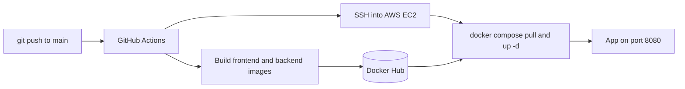
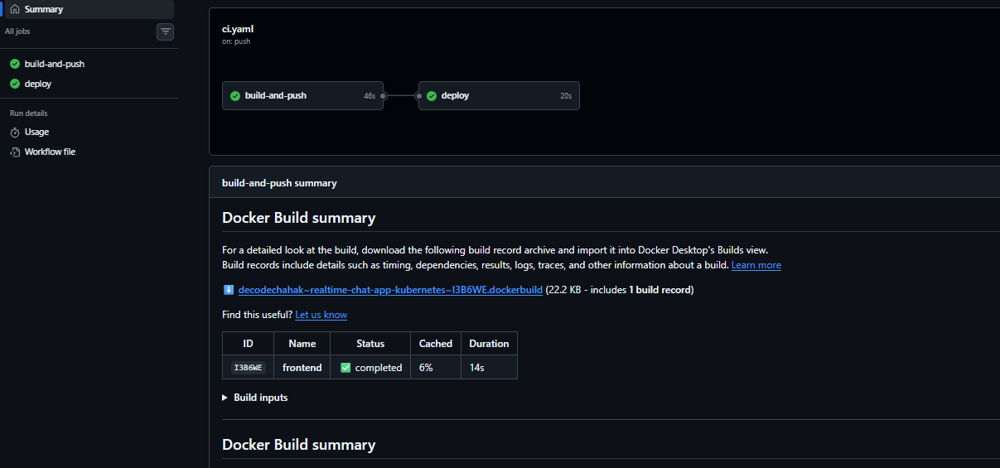
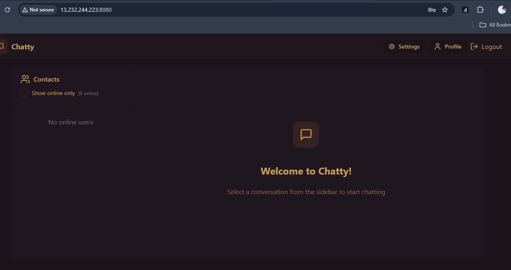
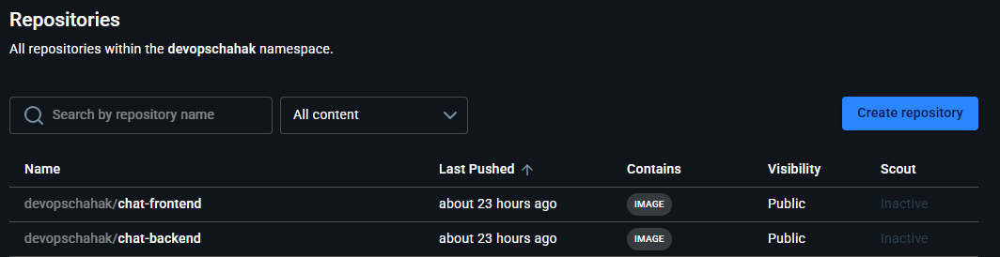
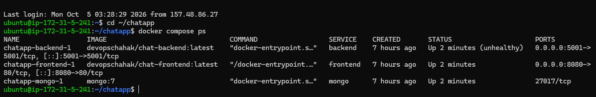

# 💬 Realtime Chat App: Kubernetes and CI/CD (GitHub Actions + AWS EC2)

A full-stack realtime chat application, containerized with Docker and deployed in two ways:

1. **Kubernetes** on a local `kind` cluster (multi-service orchestration, Secrets, persistent storage, Ingress)
2. **Automated CI/CD pipeline**: GitHub Actions builds Docker images, pushes them to Docker Hub and deploys them to an **AWS EC2** instance with Docker Compose

> **Credits and ownership**
> - The chat application is based on an open-source project by **Burak** (MIT licensed).
> - The **Kubernetes** part was built following **Train With Shubham's** tutorial series. On top of it I added PV/PVC storage, Secrets handling, Ingress and debugging on a local `kind` cluster.
> - The **CI/CD pipeline, Docker Hub publishing and EC2 deployment** are my own work and are not part of any tutorial.

---

## 🏗️ Architecture

```
 Frontend           Backend            MongoDB
 (React/Vite  ───►  (Node.js/    ───►  (persistent
  + Nginx)           Express)           storage)
  Port 80            Port 5001          Port 27017
```

### CI/CD flow



---

## 🛠️ Tech Stack

- **Frontend:** React + Vite, served via Nginx (multi-stage Docker build)
- **Backend:** Node.js + Express, Socket.IO, JWT-based authentication
- **Database:** MongoDB with persistent storage
- **Containers:** Docker (multi-stage builds), Docker Compose
- **CI/CD:** GitHub Actions, Docker Hub
- **Cloud:** AWS EC2 (Ubuntu)
- **Orchestration:** Kubernetes (local `kind` cluster), Ingress with custom local domain routing
- **Secrets:** Kubernetes Secrets, GitHub Actions Secrets

---

## 🔁 Part 1: CI/CD Pipeline (GitHub Actions to AWS EC2)

Workflow file: `.github/workflows/ci.yaml`, triggered on every push to `main` (documentation-only changes are ignored).

| Job | What it does |
|---|---|
| `build-and-push` | Checks out the code, logs in to Docker Hub, builds the frontend and backend images and pushes them |
| `deploy` | Runs only if the build job passes. Connects to EC2 over SSH, pulls the new images, restarts the containers and removes old images |

**GitHub Actions secrets:** `DOCKERHUB_USERNAME`, `DOCKERHUB_TOKEN`, `EC2_HOST`, `EC2_USER`, `EC2_SSH_KEY`

**EC2 setup:** Ubuntu `t3.micro`, Docker with a 1 GB swap file, ports 22 and 8080 open. The server holds only a `docker-compose.yml` (images pulled from Docker Hub) and a `.env` file that is never committed. MongoDB data lives in a Docker volume.

### Run locally with Docker Compose

```bash
git clone <your-repo-url>
cd full-stack_chatApp
# create .env with: MONGODB_URI, MONGO_ROOT_USER, MONGO_ROOT_PASSWORD, JWT_SECRET, PORT, NODE_ENV
docker compose up -d --build
# open http://localhost:8080
```

---

## ☸️ Part 2: Kubernetes Deployment

All three services run as separate Kubernetes Deployments inside a dedicated `chat-app` namespace, communicating over internal ClusterIP Services.

| Resource | Purpose |
|---|---|
| `namespace.yaml` | Isolated `chat-app` namespace |
| `mongodb-deployment.yaml` / `mongodb-pv.yaml` / `mongodb-pvc.yaml` | MongoDB with persistent volume storage |
| `mongodb-service.yaml` | Internal DB service discovery |
| `backend-deployment.yaml` / `backend-service.yaml` | API server, connects to MongoDB via env-injected URI |
| `frontend-deployment.yaml` / `frontend-service.yaml` | Nginx-served static frontend |
| `secrets.yaml` | JWT secret and DB credentials (create it from `secrets.example.yaml`, never commit real values) |
| `ingress.yaml` | Custom domain routing (`chatty-ca.com` to services) |

### Prerequisites

- Docker Desktop
- [kind](https://kind.sigs.k8s.io/)
- `kubectl`

### Steps

```bash
# 1. Create a kind cluster
kind create cluster --name my-kind-cluster

# 2. Apply all Kubernetes manifests
cd k8s
kubectl apply -f namespace.yaml
kubectl apply -f secrets.yaml
kubectl apply -f mongodb-pv.yaml
kubectl apply -f mongodb-pvc.yaml
kubectl apply -f mongodb-deployment.yaml
kubectl apply -f mongodb-service.yaml
kubectl apply -f backend-deployment.yaml
kubectl apply -f backend-service.yaml
kubectl apply -f frontend-deployment.yaml
kubectl apply -f frontend-service.yaml

# 3. Verify all pods are running
kubectl get pods -n chat-app

# 4. Port-forward to access locally
kubectl port-forward service/frontend -n chat-app 80:80
kubectl port-forward service/backend -n chat-app 5001:5001
```

Then visit **http://localhost** in your browser.

*(Optional)* For custom domain access via Ingress, add `127.0.0.1 chatty-ca.com` to your hosts file and install an [nginx-ingress controller](https://kubernetes.github.io/ingress-nginx/deploy/#kind) for `kind`.

---

## ✅ What's Working

- Full container build pipeline (multi-stage Dockerfiles for frontend and backend)
- **Automated CI/CD: every push builds, publishes and deploys the app to AWS EC2**
- Kubernetes deployment across all three tiers
- Backend and MongoDB connectivity through securely injected environment variables
- JWT-based user authentication
- Secrets management (no hardcoded credentials)
- Ingress custom domain routing

## 🚧 Known Issues / Roadmap

- **Real-time chat sync between two users is not yet fully reliable**: messages and online presence do not always reflect across sessions. I am investigating whether this is a WebSocket/Socket.IO CORS or URL configuration issue between the separately hosted frontend and backend.
- Ingress controller setup for `kind` needs manual installation (not automated in the manifests)
- Planned for the pipeline: security scans (Trivy, SonarCloud), image tags by commit SHA, HTTPS with a domain

---

## 📸 Screenshots

**1. CI/CD pipeline: build and deploy jobs both green**



**2. App running on AWS EC2**



**3. Images published to Docker Hub**



**4. Containers running on EC2 (`docker compose ps`)**



---

## 🧠 What I Learned

**Kubernetes and debugging**
- Diagnosing and fixing `CrashLoopBackOff` pods via `kubectl logs` and `kubectl describe`
- Managing environment variables and Secrets correctly across services
- Understanding Docker multi-stage builds and catching a stale/mismatched image bug
- Recovering a broken `kind` cluster (corrupted Docker networking) with a full reset
- Setting up Ingress and local DNS resolution through the Windows hosts file
- Using `kubectl logs --previous` and `exec` for real root-cause debugging instead of guessing

**CI/CD and EC2**
- Writing a GitHub Actions workflow with dependent jobs and repository secrets
- Publishing images to Docker Hub with token-based auth
- Deploying over SSH with Docker Compose on a small EC2 instance
- Fixing a backend crash loop by reading container logs (a one-word typo in the code)
- Recovering from a full disk (`no space left on device`), a stuck Docker network and a MongoDB auth mismatch caused by an old volume

---

## 📄 License

This project is for educational purposes, adapted from an open-source tutorial repository. The original chat application is by Burak (MIT license).